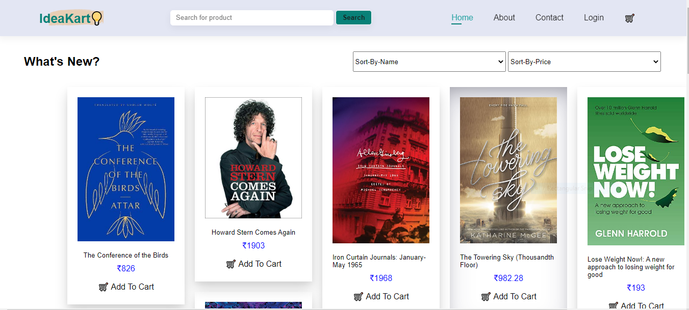
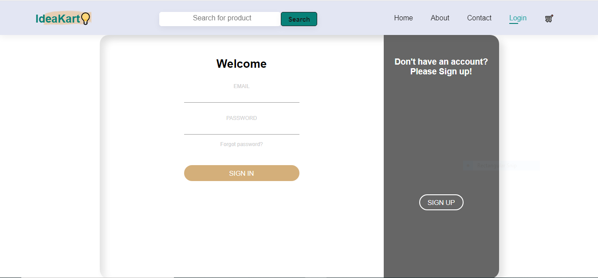
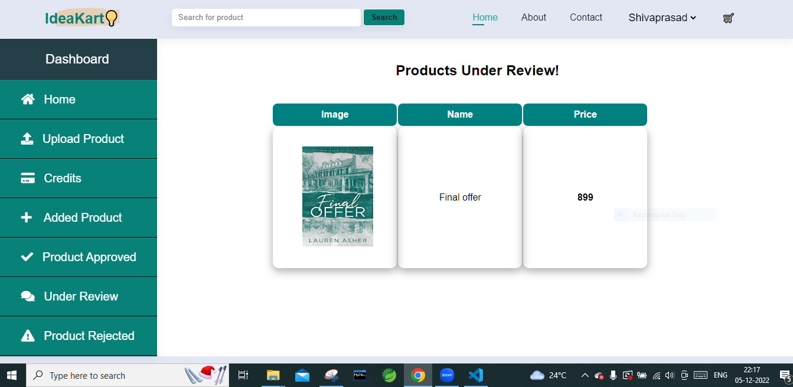

# Ideacart_Project

Hello Everyone,  we would like to share our Experience in this Construction Week, this time Masai School give me and my team members an oppotunity to build a cloned website of Idea-Kart as a part of our construct week project.

This was a group project executed within a 4 days of span.

Have a look ⬇️

**Tech Stack:**  HTML, CSS, JavaScript

**Deploying:** <a href="https://legendary-gecko-c6ccce.netlify.app/" target="_blank"></a>


## Screenshots







```
##Contributors:

## Akashy     -  @akshay-puranik
## Ankur      -  @Ankur982Sum
## Shivaprasad -  @Shivaprasad-sBhat
## Priyanshu  -  @priyanshupawar
## Shivani    -  @shiivaniiawasthii
## THANK YOU ❤️
```

